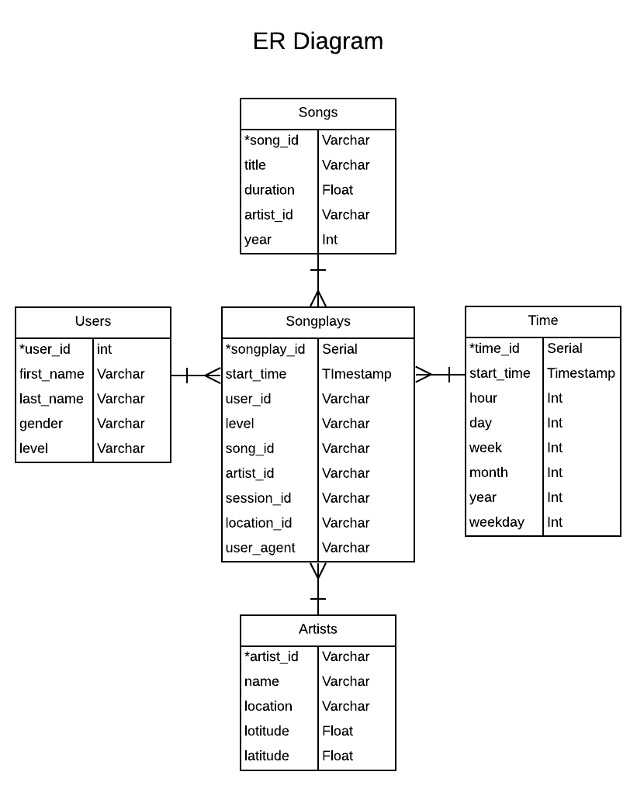

# Data Modeling with Postgres using Python and SQL  
In this project, I applied the concepts of data modelling with relational database Postgres and built an ETL pipeline using Python. I completed this project by defining fact and dimension tables for a star schema to handle specific analytical need and wrote an ETL pipeline that transfers data from JSON files in two local directories into tables in Postgres using Python and SQL.  

## Requirement
A ficitious startup called Sparkify needs to analyze the data it has been collecting on songs and user activity around listening those songs in their new music streaming app. The analytics team is particularly interested in understanding what songs users are listening to.  
 1. The data related to user activity on the app resides in a directory of JSON log files.  
 2. The metadata on the songs like title, artist name and length of the song resides in JSON files stored in separate directory.  

## Solution  
###  How to run  
From the terminal with current directory set to project directory, run following command to complete initial setup by creates database and tables with appropriate schema in Postgres.  

    python create_tables.py  
Run following command to execute python script that extract data related to songs and user activity logs from JSON files in *data* directory, does transformations and loads it into Postgres database for further analysis.  

    python etl.py  
### Database Schema
Following is ER Diagram that shows the star schema used to organize the data in different tables.  
  

### Code organisation  
The ETL code is modularised into separate files.  
 - **sql_queries.py** contains SQL query statements for creating new tables with appropriate schema, inserting data into tables.  
 - **create_tables.py** contains code for initial setup by creating database in Postgres and creating tables if not already present.  
 - **etl.py** contains code for extracting data of songs and user activity from JSON files, doing necessary transformations on data and loading them into Postgres.    
 - **etl.ipynb** is a Jupyter notebook that is helpful for developing, debugging and showcasing the unit code used for processing small amount of data related to songs and user activity.  
 - **test.ipynb** is a Jupyter notebook which comes handy to check the initial few rows of each of the database tables, which are supposed to be loaded as part of this ETL task.  
 - **data** is a directory of files containing metadata related to songs and logs of user activity in JSON format.  
